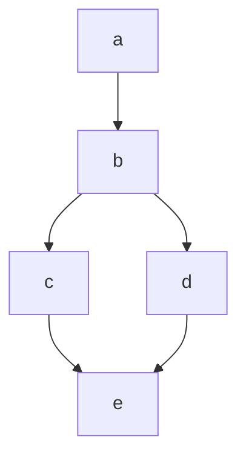

+++
title = 'Shortcode Testing'
date = 2024-08-16T14:55:24-04:00
summary = 'Testing shortcode that is added to the theme'
draft = true
+++

## notice

This is a warning notice. Be warned!



**warning** ???


## mermaid


graph LR;
A[Lemons]-->B[Lemonade];
B-->C[Profit];

